# Summary Evaluations Report

## 1. Baseline Report 
Assumptions used: 

    * size of the training dataset: 3 months
    * short_window = 4
    * long_window = 100

### A. Classification Report
    * SVC Classifier Model:
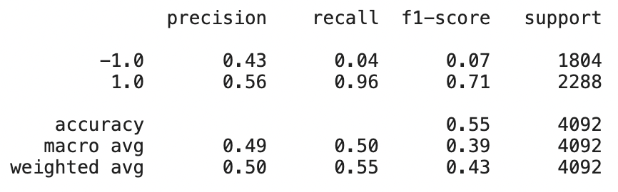

    * Linear Regression (LR) Model:
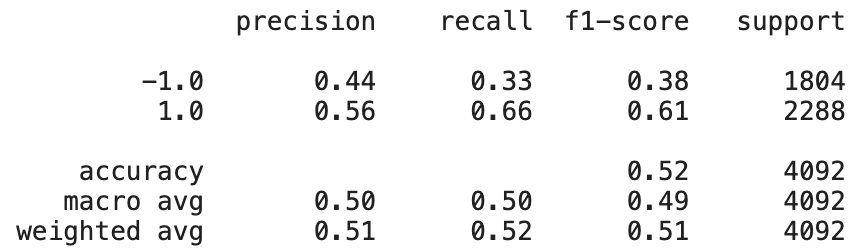

### B. Cumulative Return Plot
    * SVC Classifier Model:
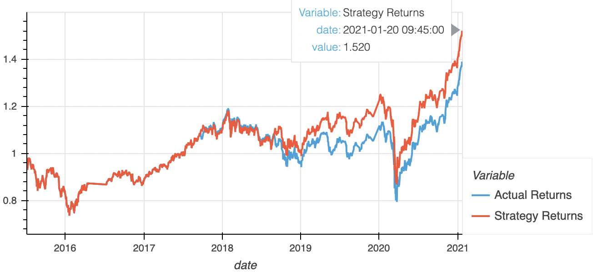

    * Linear Regression (LR) Model:
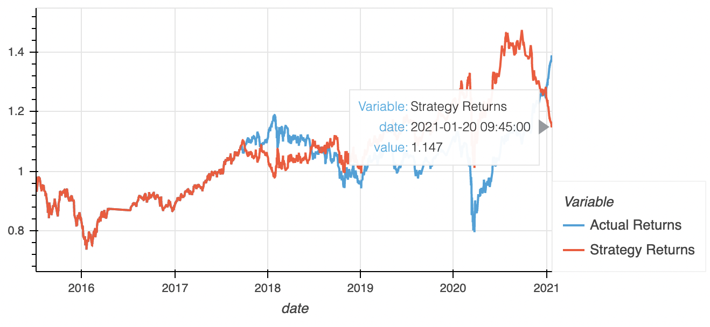

## 2. Dataset Tuned Report 
Assumptions used: 

    * size of the training dataset: 6 months
    * short_window = 4
    * long_window = 100

### A. Classification Report
    * SVC Classifier Model:
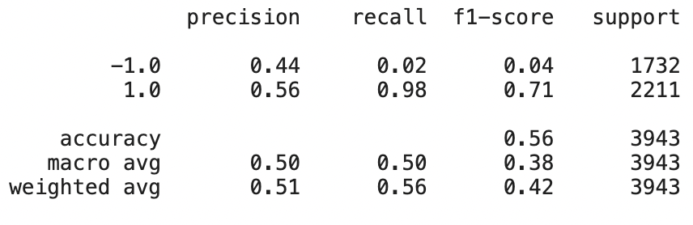

    * Linear Regression (LR) Model:
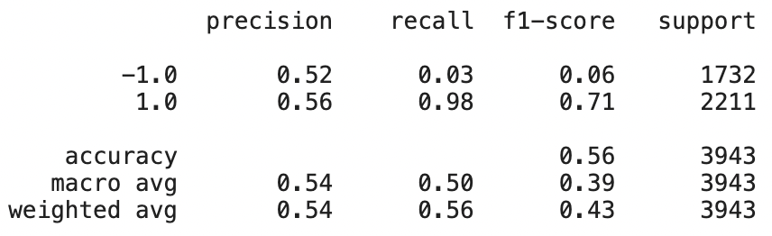

### B. Cumulative Return Plot
    * SVC Classifier Model:
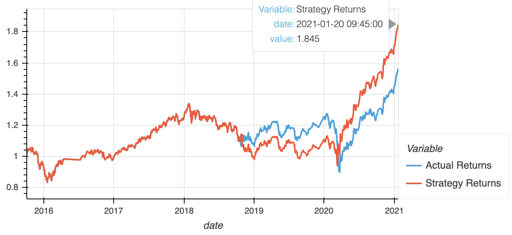

    * Linear Regression (LR) Model:
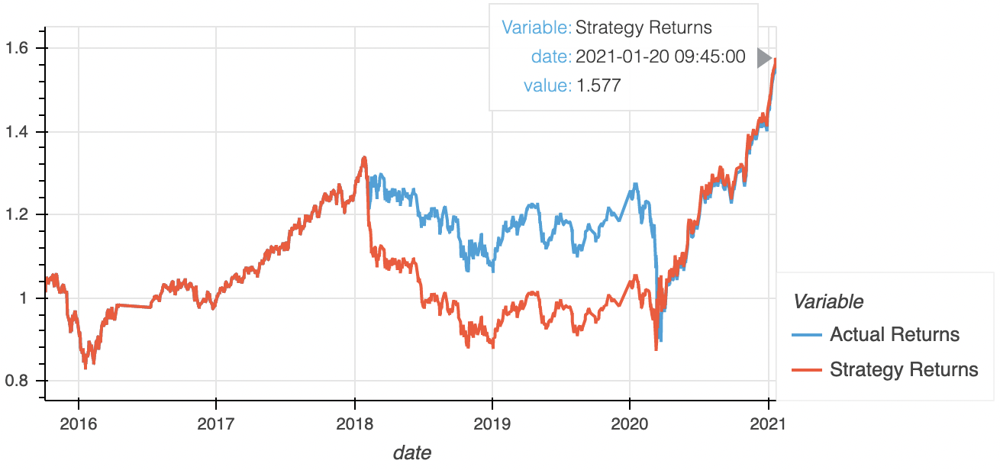

## 3. SMA Window Tuned Report 
Assumptions used: 

    * size of the training dataset: 3 months
    * short_window = 50
    * long_window = 200

### A. Classification Report
    * SVC Classifier Model:
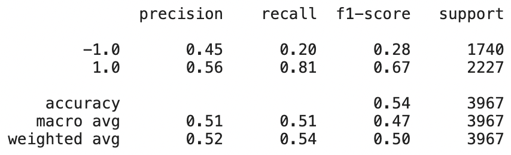

    * Linear Regression (LR) Model:
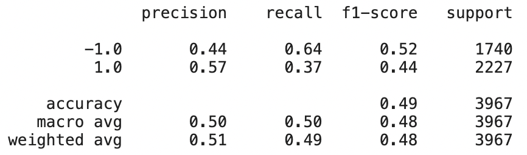

### B. Cumulative Return Plot
    * SVC Classifier Model:
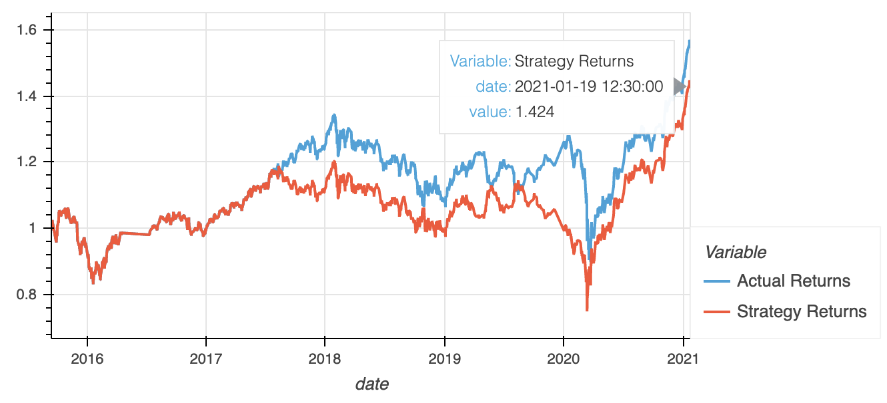

    * Linear Regression (LR) Model:
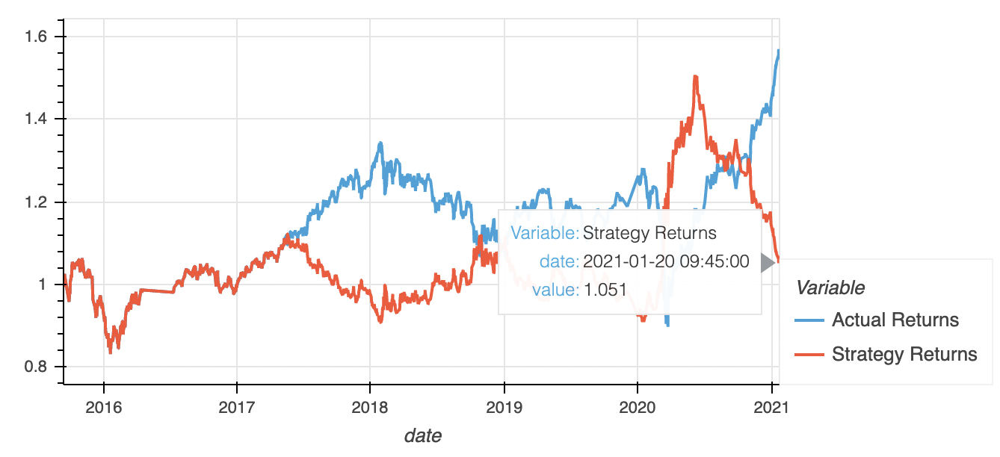

## 4. Conclusion
Baseline trading algorithm provided an accuracy of 0.55 for the SVC model and 0.52 for Linear Regression Model. There appears to be slightly higher precision for predicting buys than sells. Regardless, these are low statistics and algorithm does not seem to indicate strong predictions.

Overall, the SVC Classifier Model had higher accuracy and higher cumulative return than the Linear Regression Model across various inputs. 

Adjusting the size of training dataset from 3 months to 6 months led to slighlty increasing accuracy and greater cumulative returns in the two models. This provided the most improvement in accuracy and cumulative returns compared to other adjustments to the model.

Adjusting the SMA input features to increase rolling windows to 50 for Fast SMA and 200 for Slow SMA led to slight decrease in accuracy as wel as slight decrease cumulative returns across two models. The linear regression model appear to be more impacted by adjustments to SMA windows. 
